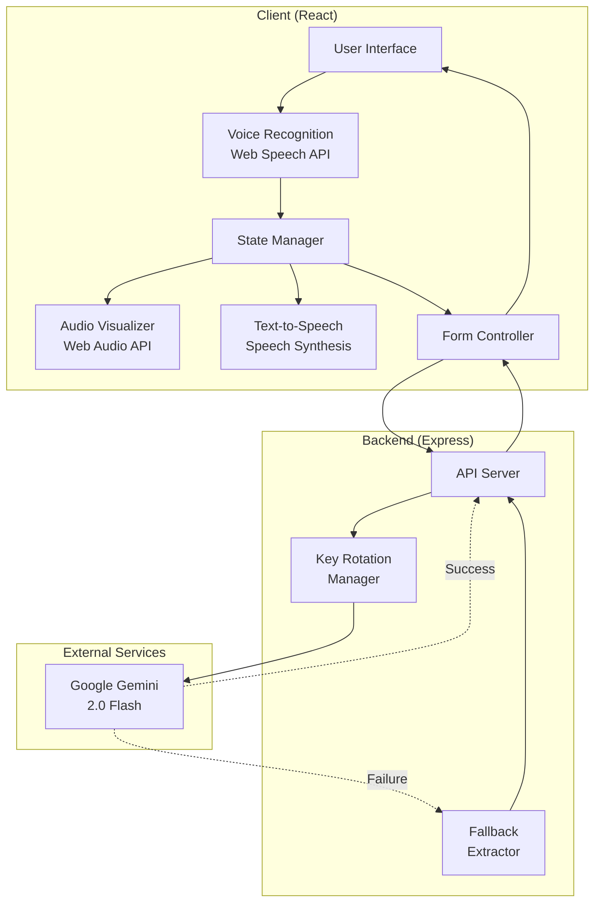
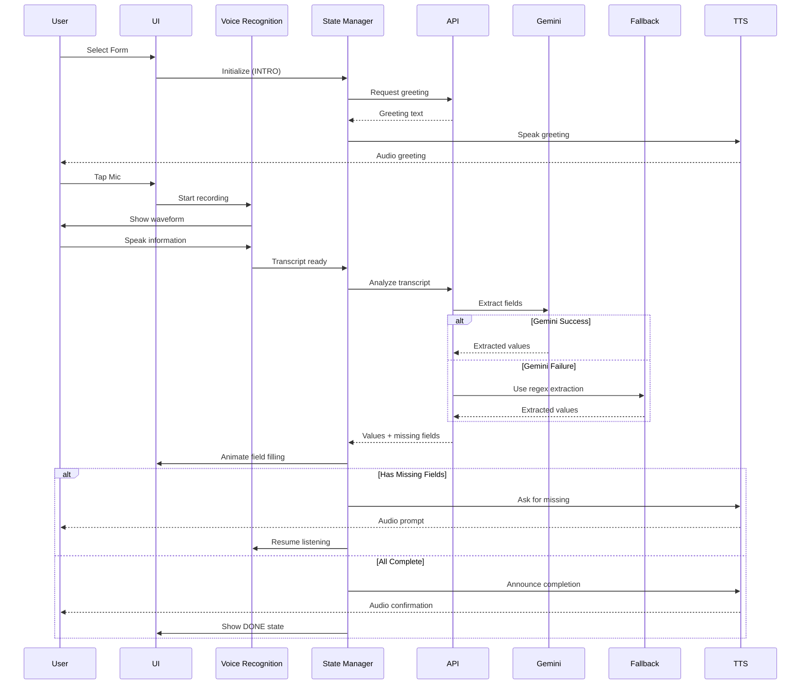

# Design Document: Pebbles Voice-Based AI Form Assistant

## Overview

Pebbles is a voice-first web application that democratizes digital form filling through natural speech interaction. The system combines Web Speech API for voice recognition, Google Gemini 2.0 Flash for intelligent field extraction, and Web Audio API for real-time visualization, creating an accessible and inclusive form-filling experience.

### Design Philosophy

The design prioritizes:
- **Accessibility First**: Voice interaction removes barriers for users with disabilities, low literacy, or typing difficulties
- **Conversational UX**: Natural dialogue flow guides users through forms without technical jargon
- **Resilience**: Multiple fallback mechanisms ensure reliability even under API failures or rate limiting
- **Real-time Feedback**: Visual and audio cues provide immediate confirmation of system actions
- **Privacy**: Minimal data retention and secure transmission protect user information

### Technology Stack

- **Frontend**: React 19 with Vite, Tailwind CSS for styling, Framer Motion for animations
- **Backend**: Node.js with Express, Google Generative AI SDK
- **AI Model**: Google Gemini 2.0 Flash for NLP and field extraction
- **Voice APIs**: Web Speech API (recognition), Speech Synthesis API (text-to-speech)
- **Audio**: Web Audio API for real-time waveform visualization

## Architecture

### System Architecture



### Component Interaction Flow



## Components and Interfaces

### Frontend Components

#### 1. Playground Component
**Responsibility**: Main orchestrator for form selection and voice interaction workflow

**State**:
```typescript
interface PlaygroundState {
  activeForm: Form | null;
  conversationState: 'IDLE' | 'INTRO' | 'LISTENING' | 'PROCESSING' | 'DONE';
  status: string;
  formValues: Record<string, string>;
  transcript: string;
  isListening: boolean;
  missingFields: string[];
  voicesLoaded: boolean;
}
```

**Key Methods**:
- `handleMicInteraction()`: Manages microphone button clicks and state transitions
- `startListening()`: Initializes voice recognition and audio visualization
- `stopListening()`: Stops recording and cleans up audio resources
- `processTranscript(text: string)`: Sends transcript to backend for analysis
- `simulateTyping(data: Record<string, string>)`: Animates field filling
- `speak(text: string)`: Converts text to speech
- `closeForm()`: Resets all state and returns to form selection

#### 2. AudioWaveform Component
**Responsibility**: Real-time visualization of audio input during recording

**Props**:
```typescript
interface AudioWaveformProps {
  isActive: boolean;
  analyser: AnalyserNode | null;
}
```

**Behavior**:
- Uses Web Audio API AnalyserNode to get frequency data
- Renders canvas with animated bars representing audio frequencies
- Updates at 60fps using requestAnimationFrame
- Displays gradient-colored bars (red gradient for active recording)
- Automatically cleans up animation frame on unmount

#### 3. Form Display Component
**Responsibility**: Renders form fields with real-time filling animation

**Features**:
- Google Forms-inspired visual design
- Color-coded field states (empty, filled, missing)
- Smooth scroll-into-view for active fields
- Read-only inputs that update via state
- Visual checkmarks for completed fields
- Highlighted borders for missing fields

### Backend Components

#### 1. Express API Server
**Endpoints**:

```typescript
// Health check
GET /
Response: {
  status: 'ok',
  model: string,
  apiKeys: number,
  currentKey: number,
  timestamp: string
}

// Chat/conversation endpoint
POST /chat
Request: {
  context: { formTitle: string },
  state: 'INTRO' | 'LISTENING_PROMPT' | 'FILLING' | 'ASK_MISSING' | 'DONE',
  fieldCount?: number,
  fieldLabels?: string[],
  missingFields?: string[]
}
Response: {
  reply: string
}

// Field extraction endpoint
POST /analyze-form
Request: {
  formFields: FormField[],
  transcript: string,
  existingValues: Record<string, string>
}
Response: {
  values: Record<string, string>,
  missingFields: string[],
  filledCount: number,
  totalFields: number,
  isComplete: boolean
}
```

#### 2. API Key Rotation Manager
**Responsibility**: Manages multiple Gemini API keys to handle rate limiting

**State**:
```typescript
interface KeyRotationState {
  apiKeys: string[];
  currentKeyIndex: number;
  genAI: GoogleGenerativeAI;
}
```

**Functions**:
- `rotateApiKey()`: Switches to next available API key
- `retryWithBackoff(fn, maxRetries, initialDelay)`: Retries failed requests with exponential backoff
- Detects rate limit errors (429, RESOURCE_EXHAUSTED, quota exceeded)
- Automatically rotates keys on rate limit detection

#### 3. Gemini AI Service Integration
**Responsibility**: Interfaces with Google Gemini 2.0 Flash for field extraction

**Extraction Prompt Structure**:
```
Extract ALL information from this speech to fill a form. Be thorough!

SPEECH: "[user transcript]"

FIELDS TO FILL:
"field_id_1": Field Label 1
"field_id_2": Field Label 2
...

INSTRUCTIONS:
- Extract EVERY piece of information mentioned
- Match spoken info to the closest field
- For name fields: extract full name (first + last)
- For email: look for @, "at", email patterns
- For phone: look for number sequences (10+ digits)
- For LinkedIn: look for linkedin mentions or urls
- For "why" questions: use any reason/motivation mentioned
- Return ONLY valid JSON with field IDs as keys
- Use "" for truly missing fields

OUTPUT FORMAT (JSON only, no markdown):
{"field_id_1": "value1", "field_id_2": "value2", ...}
```

**Response Processing**:
- Cleans markdown code blocks from response
- Extracts JSON using regex matching
- Merges with existing values (preserves filled fields)
- Identifies missing fields by checking for empty values

#### 4. Fallback Regex Extractor
**Responsibility**: Provides reliable extraction when AI service fails

**Extraction Patterns**:

```typescript
interface ExtractionPattern {
  fieldType: string;
  patterns: RegExp[];
  transform?: (match: string) => string;
}

const patterns: ExtractionPattern[] = [
  {
    fieldType: 'name',
    patterns: [
      /(?:my name is|i am|i'm|name is|this is|call me)\s+([a-z]+(?:\s+[a-z]+){0,2})/i,
      /^([a-z]+(?:\s+[a-z]+)?)\s+(?:here|speaking)/i,
      /name[:\s]+([a-z]+(?:\s+[a-z]+)?)/i
    ],
    transform: (match) => titleCase(match)
  },
  {
    fieldType: 'email',
    patterns: [
      /([a-z0-9._%+-]+@[a-z0-9.-]+\.[a-z]{2,})/i,
      /([a-z0-9._%+-]+\s*(?:at|@)\s*[a-z0-9.-]+\s*(?:dot|\.)\s*[a-z]{2,})/i
    ],
    transform: (match) => match.replace(/\s*at\s*/gi, '@').replace(/\s*dot\s*/gi, '.').toLowerCase()
  },
  {
    fieldType: 'phone',
    patterns: [
      /(?:phone|mobile|number|contact)[:\s]*[\s]*([\d\s\-+()]{10,})/i,
      /(?:call me at|reach me at)\s*([\d\s\-+()]{10,})/i,
      /([\+]?\d{1,3}[\s\-]?\d{3,5}[\s\-]?\d{3,5}[\s\-]?\d{2,5})/,
      /(\d{10,})/
    ]
  },
  // ... additional patterns for company, linkedin, date, dietary, symptoms, rating
];
```

**Extraction Algorithm**:
1. Iterate through all form fields
2. Skip fields that are already filled
3. Match field label against field type patterns
4. Apply regex patterns in priority order
5. Transform matched value if transform function exists
6. Store extracted value in result object
7. Return extracted values and missing fields list

### Data Models

#### Form Structure
```typescript
interface Form {
  id: number;
  title: string;
  description: string;
  fields: FormField[];
  color: string;        // Tailwind CSS class
  themeColor: string;   // Hex color code
}

interface FormField {
  id: string;           // Unique identifier (e.g., "entry.2005620554")
  label: string;        // Human-readable label
  type: 'text' | 'email' | 'tel' | 'url' | 'date' | 'number' | 'textarea';
}
```

#### Conversation State Machine
```typescript
type ConversationState = 
  | 'IDLE'        // No form active or waiting for user action
  | 'INTRO'       // AI introducing form and listing fields
  | 'LISTENING'   // Actively recording user speech
  | 'PROCESSING'  // Analyzing transcript and extracting fields
  | 'DONE';       // All fields filled, form complete

interface StateTransition {
  from: ConversationState;
  to: ConversationState;
  trigger: string;
  action?: () => void;
}

const transitions: StateTransition[] = [
  { from: 'IDLE', to: 'INTRO', trigger: 'mic_button_pressed', action: speakGreeting },
  { from: 'INTRO', to: 'LISTENING', trigger: 'greeting_complete', action: startRecording },
  { from: 'LISTENING', to: 'PROCESSING', trigger: 'transcript_ready', action: analyzeTranscript },
  { from: 'PROCESSING', to: 'LISTENING', trigger: 'has_missing_fields', action: askForMissing },
  { from: 'PROCESSING', to: 'DONE', trigger: 'all_fields_complete', action: announceCompletion },
  { from: 'DONE', to: 'IDLE', trigger: 'reset_button_pressed', action: clearForm }
];
```

#### API Response Models
```typescript
interface AnalyzeFormResponse {
  values: Record<string, string>;      // Extracted field values
  missingFields: string[];             // Labels of unfilled fields
  filledCount: number;                 // Number of filled fields
  totalFields: number;                 // Total number of fields
  isComplete: boolean;                 // True if all fields filled
}

interface ChatResponse {
  reply: string;                       // Natural language response from AI
}

interface HealthCheckResponse {
  status: 'ok' | 'error';
  model: string;
  apiKeys: number;
  currentKey: number;
  timestamp: string;
}
```

### Voice Recognition Integration

#### Web Speech API Configuration
```typescript
interface SpeechRecognitionConfig {
  continuous: true;           // Keep listening until explicitly stopped
  interimResults: true;       // Provide real-time partial results
  lang: 'en-US';             // Language code (configurable for multi-language)
  maxAlternatives: 1;        // Number of alternative transcriptions
}
```

#### Recognition Event Handling
```typescript
recognition.onresult = (event: SpeechRecognitionEvent) => {
  let finalTranscript = '';
  let interimTranscript = '';
  
  for (let i = 0; i < event.results.length; i++) {
    const transcript = event.results[i][0].transcript;
    if (event.results[i].isFinal) {
      finalTranscript += transcript + ' ';
    } else {
      interimTranscript += transcript;
    }
  }
  
  const fullTranscript = finalTranscript || interimTranscript;
  updateTranscript(fullTranscript);
  resetSilenceTimeout();  // Reset 2.5s silence timer
};

recognition.onerror = (event: SpeechRecognitionErrorEvent) => {
  if (event.error === 'no-speech') {
    notifyUser("No speech detected. Tap to try again.");
  } else if (event.error === 'audio-capture') {
    notifyUser("Microphone access denied.");
  } else {
    notifyUser("Speech recognition error occurred.");
  }
  transitionToState('IDLE');
};
```

### Audio Visualization

#### Web Audio API Setup
```typescript
async function initializeAudioVisualization(): Promise<AnalyserNode> {
  const stream = await navigator.mediaDevices.getUserMedia({ audio: true });
  const audioContext = new AudioContext();
  const analyser = audioContext.createAnalyser();
  const source = audioContext.createMediaStreamSource(stream);
  
  analyser.fftSize = 64;  // Frequency bin count
  source.connect(analyser);
  
  return analyser;
}
```

#### Waveform Rendering
```typescript
function renderWaveform(analyser: AnalyserNode, canvas: HTMLCanvasElement) {
  const ctx = canvas.getContext('2d');
  const bufferLength = analyser.frequencyBinCount;
  const dataArray = new Uint8Array(bufferLength);
  
  function draw() {
    requestAnimationFrame(draw);
    analyser.getByteFrequencyData(dataArray);
    
    ctx.fillStyle = 'rgba(243, 244, 246, 1)';
    ctx.fillRect(0, 0, canvas.width, canvas.height);
    
    const barWidth = (canvas.width / bufferLength) * 2.5;
    let x = 0;
    
    for (let i = 0; i < bufferLength; i++) {
      const barHeight = (dataArray[i] / 255) * canvas.height * 0.8;
      const gradient = ctx.createLinearGradient(0, canvas.height - barHeight, 0, canvas.height);
      gradient.addColorStop(0, '#ef4444');
      gradient.addColorStop(1, '#dc2626');
      
      ctx.fillStyle = gradient;
      ctx.fillRect(x, canvas.height - barHeight, barWidth - 1, barHeight);
      x += barWidth;
    }
  }
  
  draw();
}
```

### Speech Synthesis

#### Voice Selection Strategy
```typescript
function selectBestVoice(): SpeechSynthesisVoice | null {
  const voices = window.speechSynthesis.getVoices();
  const preferredVoices = [
    'Google UK English Female',
    'Google US English',
    'Samantha',
    'Microsoft Zira',
    'Microsoft David'
  ];
  
  for (const preferred of preferredVoices) {
    const voice = voices.find(v => v.name.includes(preferred));
    if (voice) return voice;
  }
  
  return voices.find(v => v.lang.startsWith('en')) || voices[0];
}
```

#### Speech Configuration
```typescript
function speak(text: string): Promise<void> {
  return new Promise((resolve) => {
    const processedText = text
      .replace(/\.\.\.(?=\s|$)/g, '... ')
      .replace(/\.(?=\s|$)/g, '. ')
      .replace(/!/g, '! ')
      .replace(/\?/g, '? ');
    
    const utterance = new SpeechSynthesisUtterance(processedText);
    utterance.voice = selectedVoice;
    utterance.rate = 0.95;    // Slightly slower for clarity
    utterance.pitch = 1.0;    // Natural pitch
    utterance.volume = 1.0;   // Full volume
    
    utterance.onend = () => resolve();
    utterance.onerror = () => resolve();  // Continue even on error
    
    window.speechSynthesis.speak(utterance);
  });
}
```

## Correctness Properties

*A property is a characteristic or behavior that should hold true across all valid executions of a system—essentially, a formal statement about what the system should do. Properties serve as the bridge between human-readable specifications and machine-verifiable correctness guarantees.*


### Property 1: Voice Recording State Consistency
*For any* user interaction with the microphone button, the system state should correctly reflect the recording status, and the Audio_Visualizer should be visible if and only if recording is active.
**Validates: Requirements 1.2, 1.3, 9.1, 9.3**

### Property 2: Silence Timeout Triggers Processing
*For any* recording session, when 2.5 seconds of silence is detected, the system should automatically stop recording and transition to PROCESSING state with the captured transcript.
**Validates: Requirements 1.4**

### Property 3: Manual Stop Processes Transcript
*For any* active recording session, tapping the microphone button should immediately stop recording and process the captured transcript.
**Validates: Requirements 1.5**

### Property 4: Transcript Generation from Audio
*For any* captured audio input, the Voice_Recognition_Engine should generate a text transcript that is made available to the system.
**Validates: Requirements 1.6**

### Property 5: Field Extraction Completeness
*For any* transcript containing multiple pieces of information and any form structure, the Gemini_AI_Service should extract all recognizable information and map it to appropriate form fields based on field labels and types.
**Validates: Requirements 2.1, 2.2, 2.3**

### Property 6: Type-Specific Field Extraction
*For any* transcript containing data of a specific type (name, email, phone, date, company, URL, descriptive text, or rating), the extraction service should correctly identify and extract that data to the corresponding field type.
**Validates: Requirements 2.4, 2.5, 2.6, 2.7, 2.8, 2.9, 2.10, 2.11**

### Property 7: Extraction Response Structure
*For any* completed extraction operation, the response should contain extracted values as a key-value map, a list of missing field labels, filled count, total count, and a boolean completion status.
**Validates: Requirements 2.12**

### Property 8: Fallback Activation on AI Failure
*For any* Gemini_AI_Service failure or error, the system should automatically invoke the Fallback_Extractor to process the transcript using regex patterns.
**Validates: Requirements 3.1, 12.3**

### Property 9: Fallback Extraction Patterns
*For any* transcript containing recognizable patterns (name, email, phone, company, etc.), the Fallback_Extractor should extract those values using regex matching.
**Validates: Requirements 3.2, 3.3, 3.4, 3.5, 3.6**

### Property 10: Fallback Format Consistency
*For any* extraction performed by the Fallback_Extractor, the output format should match the Gemini_AI_Service response structure (values map, missing fields list, counts, completion status).
**Validates: Requirements 3.7**

### Property 11: API Key Rotation on Rate Limit
*For any* rate limit error (429, RESOURCE_EXHAUSTED, or quota exceeded), the system should rotate to the next available API key and reinitialize the Gemini_AI_Service.
**Validates: Requirements 4.2, 4.3**

### Property 12: Retry with Exponential Backoff
*For any* rate limit error, the system should retry the operation up to 3 times with exponentially increasing delays between attempts.
**Validates: Requirements 4.5**

### Property 13: Key Rotation Logging
*For any* API key rotation event, the system should log the rotation with the current key index and timestamp.
**Validates: Requirements 4.6**

### Property 14: State Machine Transitions
*For any* valid state transition trigger (form selection, greeting complete, transcript ready, missing fields detected, all fields complete, reset), the system should transition to the correct next state according to the conversation state machine.
**Validates: Requirements 5.1, 5.3, 5.5, 5.6, 5.7, 5.8**

### Property 15: State-Specific Behavior
*For any* conversation state (INTRO, LISTENING, PROCESSING, DONE), the system should exhibit the correct behavior for that state (speech synthesis in INTRO, transcript display in LISTENING, field extraction in PROCESSING, reset availability in DONE).
**Validates: Requirements 5.2, 5.4**

### Property 16: Error Recovery to IDLE
*For any* error that occurs during operation, the system should transition to IDLE state and display an appropriate error message.
**Validates: Requirements 5.9, 12.1**

### Property 17: Form Loading and Context
*For any* form selection, the system should load the complete form structure (fields, labels, types) and use that structure for all subsequent extraction operations.
**Validates: Requirements 6.2, 6.3**

### Property 18: Form Display Completeness
*For any* active form, the UI should display the form title, description, and all form fields.
**Validates: Requirements 6.4**

### Property 19: Form Closure Cleanup
*For any* form closure action, the system should reset all state (conversation state, form values, transcript, missing fields) and return to the form selection screen.
**Validates: Requirements 6.5, 14.2, 14.3**

### Property 20: Animated Field Filling
*For any* extracted field value, the system should animate the typing of that value into the corresponding form field at approximately 15ms per character, scroll the field into view, and display a status message indicating which field is being filled.
**Validates: Requirements 7.1, 7.2, 7.3, 7.4**

### Property 21: Field Visual Indicators
*For any* form field, the system should display appropriate visual indicators: a checkmark for filled fields, distinct highlighting for missing fields, and a completion indicator when all fields are filled.
**Validates: Requirements 7.5, 7.6, 7.7, 11.4**

### Property 22: Progress Calculation and Display
*For any* form with filled and unfilled fields, the Progress_Tracker should correctly calculate the completion percentage as (filled fields / total fields) × 100 and display it with an animated progress bar.
**Validates: Requirements 8.1, 8.2, 8.3, 8.4, 8.5**

### Property 23: Audio Visualizer Update Frequency
*For any* active recording session with audio input, the Audio_Visualizer should update the waveform display at least 30 times per second using Web Audio API frequency data.
**Validates: Requirements 9.2, 9.4**

### Property 24: Speech Synthesis Invocation
*For any* system communication need (greeting, acknowledgment, missing field prompt, completion announcement), the Speech_Synthesis should be invoked to convert the text response to speech.
**Validates: Requirements 10.1**

### Property 25: Speech Configuration
*For any* speech synthesis operation, the system should use a preferred high-quality English voice with rate 0.95, pitch 1.0, and volume 1.0.
**Validates: Requirements 10.2, 10.3**

### Property 26: Speech Status Indication
*For any* active speech synthesis operation, the system should display "AI Speaking..." status, and upon completion, should proceed to the next conversation state.
**Validates: Requirements 10.4, 10.5**

### Property 27: Speech Synthesis Graceful Degradation
*For any* speech synthesis failure, the system should continue operation without audio output, and when a form is closed, any ongoing speech should be cancelled.
**Validates: Requirements 10.6, 10.7**

### Property 28: Missing Field Detection
*For any* extraction result, the system should identify all fields that are empty or contain only whitespace as missing fields.
**Validates: Requirements 11.1**

### Property 29: Missing Field Prompting
*For any* non-empty set of missing fields, the system should generate a natural language prompt that includes up to 4 field names asking the user to provide that information.
**Validates: Requirements 11.2, 11.3**

### Property 30: Value Merging Preservation
*For any* subsequent extraction after initial field filling, the system should merge new values with existing values, preserving all previously filled fields and only updating empty fields or adding new values.
**Validates: Requirements 11.5, 11.6**

### Property 31: Error Logging
*For any* error that occurs (recognition error, API error, extraction error), the system should log the error details including error type, message, and context.
**Validates: Requirements 12.6**

### Property 32: Data Preservation During Error Recovery
*For any* error recovery, the system should preserve all previously filled form field values.
**Validates: Requirements 12.7**

### Property 33: Transcript-Only Transmission
*For any* API request to the Gemini_AI_Service, only text transcripts should be transmitted, never raw audio data.
**Validates: Requirements 14.1**

### Property 34: No Local Data Persistence
*For any* form interaction, the system should not persist form data to local storage, cookies, or any other client-side storage mechanism.
**Validates: Requirements 14.4**

### Property 35: PII Logging Prevention
*For any* logging operation, the system should not log or store personally identifiable information extracted from transcripts.
**Validates: Requirements 14.6**

### Property 36: Language Configuration Support
*For any* voice recognition or speech synthesis operation, the system should support language code configuration to enable future multi-language capabilities.
**Validates: Requirements 17.1, 17.2, 17.3, 17.4**

### Property 37: Health Check Response Structure
*For any* health check request, the system should return a response containing status, model name, API key count, current key index, and timestamp.
**Validates: Requirements 18.2**

### Property 38: Metrics Collection
*For any* extraction operation, the system should track whether it was successful, whether it used AI or fallback extraction, and log key rotation events with timestamps.
**Validates: Requirements 18.3, 18.4, 18.5, 18.6**

## Error Handling

### Error Categories and Responses

#### 1. Voice Recognition Errors
```typescript
interface VoiceRecognitionError {
  type: 'no-speech' | 'audio-capture' | 'not-allowed' | 'network' | 'aborted';
  message: string;
  recoverable: boolean;
}

function handleVoiceError(error: VoiceRecognitionError): void {
  switch (error.type) {
    case 'no-speech':
      displayMessage("No speech detected. Tap to try again.");
      transitionToState('IDLE');
      break;
    case 'audio-capture':
    case 'not-allowed':
      displayMessage("Microphone access denied. Please grant permission.");
      transitionToState('IDLE');
      break;
    case 'network':
      displayMessage("Network error. Check your connection.");
      transitionToState('IDLE');
      break;
    case 'aborted':
      // User cancelled, no message needed
      transitionToState('IDLE');
      break;
  }
  logError('VoiceRecognition', error);
}
```

#### 2. API Errors
```typescript
interface APIError {
  statusCode: number;
  message: string;
  isRateLimit: boolean;
  retryable: boolean;
}

async function handleAPIError(error: APIError, attempt: number): Promise<void> {
  logError('API', error);
  
  if (error.isRateLimit && attempt < 3) {
    rotateApiKey();
    await delay(Math.pow(2, attempt) * 500);  // Exponential backoff
    return;  // Retry
  }
  
  if (error.statusCode >= 500 && attempt < 3) {
    await delay(1000);
    return;  // Retry server errors
  }
  
  // Fall back to regex extraction
  console.log("Using fallback extraction due to API error");
  useFallbackExtraction();
}
```

#### 3. Extraction Errors
```typescript
interface ExtractionError {
  phase: 'parsing' | 'mapping' | 'validation';
  message: string;
  transcript: string;
}

function handleExtractionError(error: ExtractionError): void {
  logError('Extraction', error);
  
  if (error.phase === 'parsing') {
    // JSON parsing failed, try fallback
    useFallbackExtraction();
  } else {
    // Mapping or validation failed, notify user
    displayMessage("Couldn't understand that. Please try again.");
    transitionToState('IDLE');
  }
}
```

#### 4. Browser Compatibility Errors
```typescript
function checkBrowserCompatibility(): CompatibilityResult {
  const issues: string[] = [];
  
  if (!window.SpeechRecognition && !window.webkitSpeechRecognition) {
    issues.push("Speech recognition not supported. Please use Chrome.");
  }
  
  if (!window.speechSynthesis) {
    issues.push("Text-to-speech not supported.");
  }
  
  if (!window.AudioContext && !window.webkitAudioContext) {
    issues.push("Audio visualization not supported.");
  }
  
  return {
    compatible: issues.length === 0,
    issues,
    canProceed: !issues.includes("Speech recognition not supported")
  };
}
```

### Error Recovery Strategies

1. **Automatic Retry**: API rate limits and transient network errors
2. **Fallback Mechanism**: AI service failures fall back to regex extraction
3. **User Notification**: Clear error messages with actionable guidance
4. **State Reset**: Errors return system to IDLE state for clean recovery
5. **Data Preservation**: Form values preserved during error recovery
6. **Graceful Degradation**: System continues without non-critical features (e.g., TTS)

## Testing Strategy

### Dual Testing Approach

The testing strategy employs both unit tests and property-based tests to ensure comprehensive coverage:

- **Unit Tests**: Validate specific examples, edge cases, error conditions, and integration points
- **Property Tests**: Verify universal properties across randomized inputs to catch edge cases

### Unit Testing Focus Areas

1. **State Machine Transitions**
   - Test each valid state transition with specific triggers
   - Test invalid transitions are rejected
   - Test error transitions to IDLE state

2. **API Integration**
   - Mock Gemini API responses for success and failure cases
   - Test API key rotation logic with mocked rate limit errors
   - Test fallback activation when API fails

3. **UI Component Behavior**
   - Test form selection loads correct form structure
   - Test field filling animation with specific values
   - Test progress bar updates with known field counts

4. **Error Handling**
   - Test each error type triggers correct handler
   - Test error messages are displayed
   - Test state recovery after errors

5. **Edge Cases**
   - Empty transcripts
   - Transcripts with no extractable information
   - Forms with all fields already filled
   - Simultaneous state transitions

### Property-Based Testing Configuration

**Library**: Use `fast-check` for JavaScript/TypeScript property-based testing

**Configuration**: Each property test should run minimum 100 iterations

**Test Tagging**: Each test must reference its design property
```typescript
// Example test structure
describe('Feature: voice-form-assistant, Property 5: Field Extraction Completeness', () => {
  it('should extract all recognizable information from any transcript', () => {
    fc.assert(
      fc.property(
        arbitraryTranscript(),
        arbitraryFormStructure(),
        (transcript, formStructure) => {
          const result = extractFields(transcript, formStructure);
          // Verify all extractable info was found
          const extractableInfo = identifyExtractableInfo(transcript);
          extractableInfo.forEach(info => {
            expect(result.values).toContainInfoMatching(info);
          });
        }
      ),
      { numRuns: 100 }
    );
  });
});
```

### Property Test Generators

```typescript
// Arbitrary generators for property tests
const arbitraryTranscript = () => fc.record({
  name: fc.option(fc.fullName()),
  email: fc.option(fc.emailAddress()),
  phone: fc.option(fc.phoneNumber()),
  company: fc.option(fc.companyName()),
  description: fc.option(fc.lorem({ maxCount: 50 }))
}).map(parts => {
  const sentences: string[] = [];
  if (parts.name) sentences.push(`My name is ${parts.name}`);
  if (parts.email) sentences.push(`Email is ${parts.email}`);
  if (parts.phone) sentences.push(`Phone number ${parts.phone}`);
  if (parts.company) sentences.push(`I work at ${parts.company}`);
  if (parts.description) sentences.push(parts.description);
  return sentences.join('. ');
});

const arbitraryFormStructure = () => fc.array(
  fc.record({
    id: fc.uuid(),
    label: fc.constantFrom('Full Name', 'Email', 'Phone', 'Company', 'Description'),
    type: fc.constantFrom('text', 'email', 'tel', 'textarea')
  }),
  { minLength: 1, maxLength: 10 }
);

const arbitraryConversationState = () => 
  fc.constantFrom('IDLE', 'INTRO', 'LISTENING', 'PROCESSING', 'DONE');
```

### Integration Testing

1. **End-to-End Form Filling Flow**
   - User selects form → hears greeting → speaks info → sees fields fill → receives completion
   - Test with multiple form types
   - Test with partial information requiring follow-up

2. **API Failure Scenarios**
   - Test graceful degradation when Gemini API is unavailable
   - Test key rotation under sustained rate limiting
   - Test fallback extraction produces usable results

3. **Multi-Turn Conversations**
   - Test filling form across multiple voice inputs
   - Test value merging preserves existing data
   - Test missing field prompts guide user to completion

### Performance Testing

While not part of unit/property tests, the following performance benchmarks should be validated:

- Voice recognition interim results: < 500ms
- Field extraction API response: < 3 seconds (normal conditions)
- Field filling animation: 60fps
- Audio visualization: 30fps minimum
- Form switching: < 200ms

### Accessibility Testing

Manual testing required for:
- Screen reader compatibility with status messages
- Keyboard navigation through form selection
- Color contrast ratios (automated tools can assist)
- Voice-only interaction flow (no mouse/keyboard needed)
- Mobile touch target sizes (minimum 44x44px)

### Browser Compatibility Testing

Test matrix:
- Chrome (desktop and mobile) - full support expected
- Edge (Chromium) - full support expected
- Safari - partial support (Web Speech API limitations)
- Firefox - partial support (Web Speech API limitations)

## Deployment Considerations

### Environment Configuration

```bash
# Backend .env
GEMINI_API_KEY_1=your_primary_key
GEMINI_API_KEY_2=your_secondary_key
GEMINI_API_KEY_3=your_tertiary_key
PORT=5000

# Frontend .env
VITE_API_URL=https://api.yourserver.com
```

### Security Headers

```javascript
// Express security middleware
app.use(helmet({
  contentSecurityPolicy: {
    directives: {
      defaultSrc: ["'self'"],
      scriptSrc: ["'self'", "'unsafe-inline'"],
      styleSrc: ["'self'", "'unsafe-inline'"],
      connectSrc: ["'self'", "https://generativelanguage.googleapis.com"]
    }
  }
}));
```

### CORS Configuration

```javascript
app.use(cors({
  origin: process.env.FRONTEND_URL || 'http://localhost:5173',
  methods: ['GET', 'POST'],
  credentials: false
}));
```

### Rate Limiting

```javascript
const rateLimit = require('express-rate-limit');

const limiter = rateLimit({
  windowMs: 15 * 60 * 1000,  // 15 minutes
  max: 100,  // Limit each IP to 100 requests per window
  message: 'Too many requests, please try again later.'
});

app.use('/analyze-form', limiter);
app.use('/chat', limiter);
```

### Monitoring and Logging

```javascript
// Structured logging
const logger = {
  info: (message, meta) => console.log(JSON.stringify({ level: 'info', message, ...meta, timestamp: new Date().toISOString() })),
  error: (message, meta) => console.error(JSON.stringify({ level: 'error', message, ...meta, timestamp: new Date().toISOString() })),
  warn: (message, meta) => console.warn(JSON.stringify({ level: 'warn', message, ...meta, timestamp: new Date().toISOString() }))
};

// Usage
logger.info('API key rotated', { keyIndex: currentKeyIndex, reason: 'rate_limit' });
logger.error('Extraction failed', { error: error.message, transcript: transcript.substring(0, 50) });
```

### Scalability Considerations

1. **Horizontal Scaling**: Stateless backend allows multiple instances behind load balancer
2. **API Key Pool**: Support for unlimited API keys through environment variable array
3. **Caching**: Consider caching common extraction patterns (not implemented in MVP)
4. **CDN**: Serve static frontend assets through CDN for global performance
5. **Database**: Current implementation is stateless; add database for user accounts, form templates, or analytics

## Future Enhancements

### Multi-Language Support

1. **Language Detection**: Auto-detect user's spoken language
2. **Localized UI**: Translate interface text based on language preference
3. **Regional Voices**: Use language-appropriate TTS voices
4. **Indian Languages**: Priority support for Hindi, Tamil, Telugu, Bengali, Marathi

### Advanced Features

1. **Form Templates**: Allow users to create custom form templates
2. **Voice Commands**: Support commands like "clear field", "go back", "submit"
3. **Offline Mode**: Cache forms and use local speech recognition when available
4. **Voice Biometrics**: Optional voice authentication for secure forms
5. **Multi-Modal Input**: Combine voice with touch/type for hybrid interaction
6. **Smart Suggestions**: AI-powered autocomplete based on partial voice input

### Analytics and Insights

1. **Usage Metrics**: Track form completion rates, average time, error rates
2. **Accessibility Impact**: Measure adoption by users with disabilities
3. **Language Distribution**: Track which languages are most used
4. **Field Difficulty**: Identify which fields cause most confusion/retries

### Integration Capabilities

1. **Webhook Support**: Send completed forms to external systems
2. **OAuth Integration**: Connect with Google Forms, Typeform, etc.
3. **API for Developers**: Allow third-party apps to use Pebbles for their forms
4. **Embeddable Widget**: JavaScript widget to add voice filling to any form

## Hackathon Alignment: AI for Bharat

### Social Impact

**Accessibility**: Pebbles removes digital barriers for:
- 62 million Indians with disabilities (Census 2011)
- Rural populations with limited typing skills
- Elderly users uncomfortable with technology
- Users with temporary injuries or mobility constraints

**Digital Literacy**: Voice-first interaction bypasses the need for:
- Keyboard proficiency
- Understanding of form field types
- Navigation of complex UIs
- Reading small text on mobile devices

**Language Inclusion**: Foundation for supporting India's linguistic diversity:
- 22 official languages
- Hundreds of regional dialects
- Mixed language speakers (Hinglish, Tanglish, etc.)

### Technical Innovation

**AI-Powered NLP**: Leverages Google Gemini 2.0 Flash for:
- Context-aware field extraction
- Natural language understanding
- Handling of informal speech patterns
- Adaptation to Indian English and accents

**Resilient Architecture**: Ensures reliability through:
- Multi-key API rotation for high availability
- Fallback regex extraction for offline capability
- Graceful degradation when services fail
- No single point of failure

**Real-Time Feedback**: Enhances user confidence with:
- Live audio visualization
- Animated field filling
- Progress tracking
- Conversational guidance

### Scalability for India

**Low Bandwidth**: Optimized for Indian internet conditions:
- Text-only API transmission (no audio uploads)
- Minimal frontend bundle size
- Progressive enhancement approach
- Works on 3G connections

**Device Compatibility**: Supports India's device ecosystem:
- Works on budget Android phones
- Responsive design for all screen sizes
- No app installation required (web-based)
- Low memory footprint

**Cost Efficiency**: Designed for sustainable operation:
- Free tier API usage optimization
- Stateless architecture reduces server costs
- CDN delivery for static assets
- Pay-per-use scaling model

### Alignment with Digital India

**Accessibility Mission**: Directly supports:
- Accessible India Campaign (Sugamya Bharat Abhiyan)
- Rights of Persons with Disabilities Act, 2016
- Digital inclusion goals

**Skill Development**: Reduces barriers to:
- Online job applications
- Government service forms
- Educational registrations
- Healthcare appointments

**Rural Connectivity**: Enables participation in:
- Digital governance initiatives
- Online banking and payments
- E-commerce and marketplaces
- Telemedicine services

## Conclusion

Pebbles represents a significant step toward inclusive digital access in India. By combining cutting-edge AI with thoughtful UX design, it transforms form filling from a barrier into an accessible, natural interaction. The system's resilient architecture, multi-language foundation, and voice-first approach position it to serve millions of users who have been excluded from digital services due to literacy, disability, or technological constraints.

The design prioritizes correctness through comprehensive property-based testing, ensures reliability through fallback mechanisms, and maintains user privacy through minimal data retention. As India continues its digital transformation, solutions like Pebbles will be essential for ensuring that progress is truly inclusive and reaches every citizen, regardless of their abilities or background.
